# mlops-autoshield

> A self-healing MLOps pipeline with Llama 3.3 70B agents powering CI/CD gating, drift analysis, and automated observability. Fully free tier — no cloud subscription required.

---

## Table of Contents

1. [Project Overview](#1-project-overview)
2. [Tech Stack (All Free Tier)](#2-tech-stack-all-free-tier)
3. [Repository Structure](#3-repository-structure)
4. [Quick Start](#4-quick-start)
5. [Phase-by-Phase Guide](#5-phase-by-phase-guide)
6. [Testing](#6-testing)
7. [API Reference](#7-api-reference)
8. [Docker & Monitoring](#8-docker--monitoring)

---

## 1. Project Overview



AutoShield is a **5-phase MLOps pipeline** that demonstrates production-grade ML engineering:

| Phase | Component | What it does |
|-------|-----------|-------------|
| **1** | Data Layer | Synthetic fraud data, feature engineering, DVC versioning |
| **2** | Experiment Tracking | MLflow runs, model registry, CI skeleton |
| **3** | GenAI Agents | Llama 3.3 70B orchestrator → gate/drift/observability agents |
| **4** | Monitoring | Prometheus metrics, Grafana dashboards, Evidently reports |
| **5** | Self-Healing | Drift trigger → LLM decision → auto-retrain → validate |

## 2. Tech Stack (All Free Tier)

- **ML**: scikit-learn, XGBoost, pandas, numpy
- **Tracking**: MLflow (local)
- **Versioning**: DVC (local storage)
- **LLM**: Llama 3.3 70B via Groq (free tier)
- **Agents**: LangChain + LangGraph
- **API**: FastAPI + uvicorn
- **Monitoring**: Prometheus + Grafana (Docker)
- **Drift**: Evidently AI, scipy (PSI, KS-test)
- **CI/CD**: GitHub Actions
- **Testing**: pytest with 50+ tests

## 3. Repository Structure

```
autoshield/
├── src/
│   ├── config.py              # Central config loader
│   ├── pipeline.py            # Main pipeline runner
│   ├── self_healing.py        # Phase 5 self-healing loop
│   ├── data/
│   │   └── loader.py          # Data ingestion & preprocessing
│   ├── models/
│   │   └── trainer.py         # Training, eval, MLflow tracking
│   ├── agents/
│   │   ├── orchestrator.py    # Agent orchestrator
│   │   ├── gate_agent.py      # CI/CD gate (approve/block)
│   │   ├── drift_agent.py     # Drift detection (PSI, KS-test)
│   │   └── observability_agent.py  # Performance monitoring
│   ├── monitoring/
│   │   ├── metrics.py         # Prometheus metrics
│   │   └── drift_reporter.py  # Evidently reports
│   └── api/
│       └── server.py          # FastAPI model serving
├── tests/                     # 50+ pytest tests
├── configs/config.yaml        # Pipeline configuration
├── docker/                    # Docker + docker-compose
├── .github/workflows/ci.yml   # GitHub Actions CI/CD
├── dvc.yaml                   # DVC pipeline
├── Makefile                   # Common commands
└── requirements.txt
```

## 4. Quick Start

```bash
# 1. Create virtual environment
python -m venv venv
venv\Scripts\activate  # Windows

# 2. Install dependencies
pip install -r requirements.txt
pip install -e ".[dev]"

# 3. (Optional) Set Groq API key for LLM agents
copy .env.example .env
# Edit .env with your GROQ_API_KEY

# 4. Run the full pipeline
python -m src.pipeline

# 5. Run tests
pytest tests/ -v

# 6. Start API server
uvicorn src.api.server:app --reload
```

## 5. Phase-by-Phase Guide

### Phase 1 — Data Layer
- Generates synthetic credit card fraud dataset (10K rows)
- Feature engineering: log-transform Amount, extract Hour
- StandardScaler, stratified train/test split

### Phase 2 — Experiment Tracking
- XGBoost classifier with class-weight tuning
- MLflow logging (params, metrics, model artifacts)
- Model registry with staging/production stages

### Phase 3 — GenAI Agents
- **Orchestrator**: Coordinates all sub-agents via Llama 3.3 70B
- **Gate Agent**: Evaluates metrics against thresholds (approve/block)
- **Drift Agent**: PSI + KS-test per feature with severity classification
- **Observability Agent**: Performance degradation detection + alerting
- All agents have rule-based fallbacks (works without API key)

### Phase 4 — Monitoring
- Prometheus counters/gauges/histograms for model serving
- Evidently AI drift HTML reports
- FastAPI `/metrics` endpoint for Prometheus scraping

### Phase 5 — Self-Healing
- Drift trigger → LLM decides retrain/rollback
- Automatic retraining pipeline
- Gate re-evaluation of new model
- Full audit trail logged

## 6. Testing

```bash
# Run all tests
pytest tests/ -v

# With coverage
pytest tests/ -v --cov=src --cov-report=term-missing

# Run specific test module
pytest tests/test_agents.py -v
pytest tests/test_data.py -v
```

**Test coverage**: 6 test modules, 50+ test cases covering:
- Data loading, preprocessing, scaling
- Model training, evaluation, persistence
- Gate agent (approve/block decisions)
- Drift detection (PSI, KS-test)
- Observability monitoring
- Orchestrator coordination
- FastAPI endpoints
- Self-healing pipeline
- Configuration validation

## 7. API Reference

| Method | Endpoint | Description |
|--------|----------|-------------|
| GET | `/health` | Liveness check |
| POST | `/predict` | Real-time inference |
| GET | `/metrics` | Prometheus metrics |
| POST | `/gate/evaluate` | Gate agent decision |
| POST | `/drift/check` | Drift detection |
| POST | `/orchestrate` | Full agent pipeline |

## 8. Docker & Monitoring

```bash
cd docker
docker-compose up -d
```

- **API**: http://localhost:8000
- **Prometheus**: http://localhost:9090
- **Grafana**: http://localhost:3000 (admin/admin)

---

*Built with ❤️ for portfolio-grade MLOps engineering.*